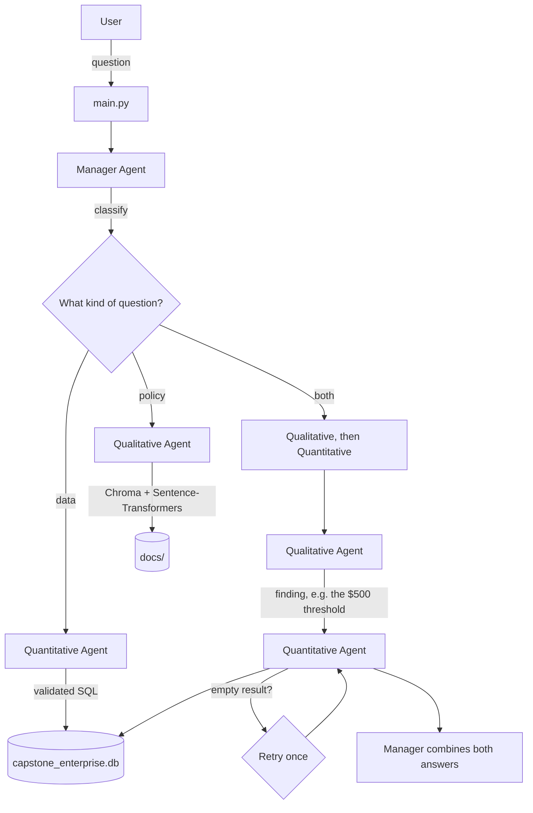

# Multi-Agent RAG System for Enterprise Documentation

A command-line assistant that answers questions about a company's policies and its data. A manager agent figures out what kind of question it's looking at and routes it to the right specialist — or both, if the question needs it. Everything runs locally: SQLite for structured data, Chroma for the policy documents, Gemini for the actual language work.

## How it works



- **Manager** (`manager_agent.py`) classifies each question with a Gemini call — not keyword matching, since some questions mention "policy" but really need a number, or vice versa. For complex questions, it asks the Qualitative Agent first, so any number it finds (an SLA, a dollar threshold) can feed into the SQL the Quantitative Agent writes.
- **Qualitative Agent** (`qualitative_agent.py`) retrieves from the policy docs in `docs/` via Chroma, then has Gemini answer from that context, citing the source.
- **Quantitative Agent** (`quantitative_agent.py`) turns a question into SQL, runs it past the validator, executes it, and has Gemini summarize the result in plain language.
- **Validator** (`sql_validation.py`) blocks anything that isn't a `SELECT`. No generated query touches the database without going through it first.
- **Tokenomics** (`tokenomics.py`) logs cost and token usage for every Gemini call across all three agents.

## Setup

```bash
python3 -m venv venv
source venv/bin/activate          # Windows: venv\Scripts\activate
pip install -r requirements.txt
cp .env.example .env              # then add your Gemini API key
python db_setup.py                # builds capstone_enterprise.db from data/
python build_vec_store.py         # builds chroma_db/ from docs/
```

## Usage

```bash
python main.py
```

Ask anything. Type `summary` for a running tokenomics report, `exit` to leave (prints a final summary automatically).

## Testing

```bash
python tests/*.py
```

Covers the SQL validator — blocks destructive queries, allows legitimate ones, 8 cases, all passing (spec requires 5).

## Sample queries

| Question | Type | Result |
|---|---|---|
| What is our company's security policy? | Policy | Summarized from `security_policy.md` |
| What's our customer churn rate? | Data | 18.2% |
| Compare Q4 performance across regions | Data | North America leads; LATAM lowest |
| Employee satisfaction vs. industry standards? | Both | 3.74/5 average; no policy currently addresses it directly |
| Are our code review turnarounds meeting our SLA? | Both | No — 58.4 hr average against a 48 hr commitment |
| How many expense requests last quarter needed manager sign-off? | Both | 9, based on the $500 threshold |

Full session, including a bug and its fix (see below), is in [`session_log.txt`](./session_log.txt).

## A bug worth mentioning

The first full run got the last two rows in that table wrong — the SQL agent generated a placeholder query for the satisfaction question and a bare boolean check for the code review one, instead of real, useful queries. Fixed by telling the prompt explicitly not to do either. Both were re-run afterward and the corrected results are what's shown above and appended at the end of the session log.

## Tokenomics (10-query run)

```
=== Tokenomics Summary (35 calls) ===
Total cost: $0.000369
  QuantitativeAgent    calls=14  tokens=6621   cost=$0.000170
  ManagerAgent         calls=14  tokens=3789   cost=$0.000104
  QualitativeAgent     calls=7   tokens=2421   cost=$0.000096

Most tokens consumed: QuantitativeAgent
```

## Project structure

```
RAG_System/
├── main.py                    # CLI
├── manager_agent.py           # classify, route, synthesize
├── qualitative_agent.py       # Chroma retrieval + Gemini
├── quantitative_agent.py      # NL to SQL + execution
├── sql_validation.py          # blocks anything but SELECT
├── tests/                     # validator test suite
├── tokenomics.py              # usage/cost logging
├── db_setup.py                # data/*.csv -> capstone_enterprise.db
├── build_vec_store.py         # docs/*.md -> chroma_db/
├── data/                      # source CSVs
├── docs/                      # policy documents
├── session_log.txt
├── requirements.txt
└── .env.example
```

`capstone_enterprise.db`, `chroma_db/`, and `venv/` are generated locally and gitignored.
